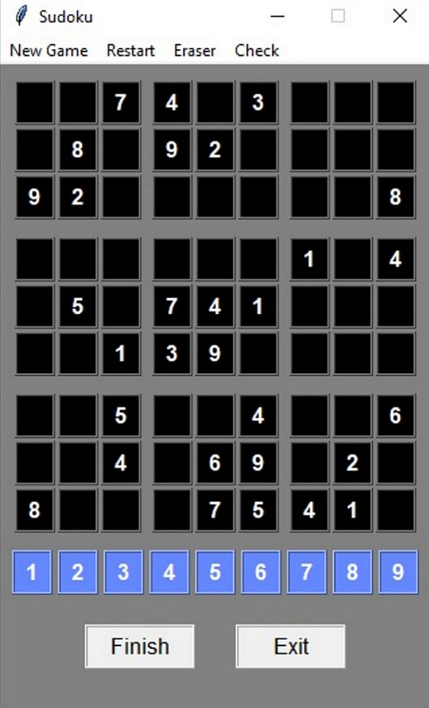
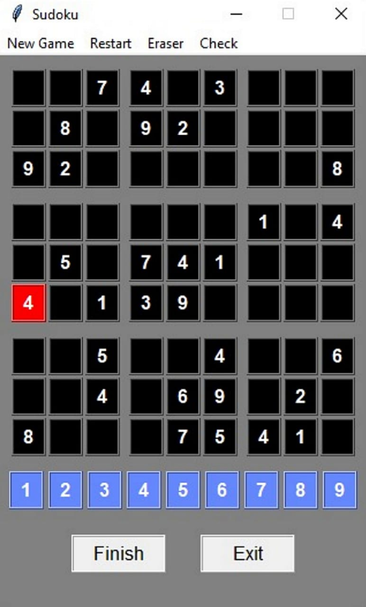
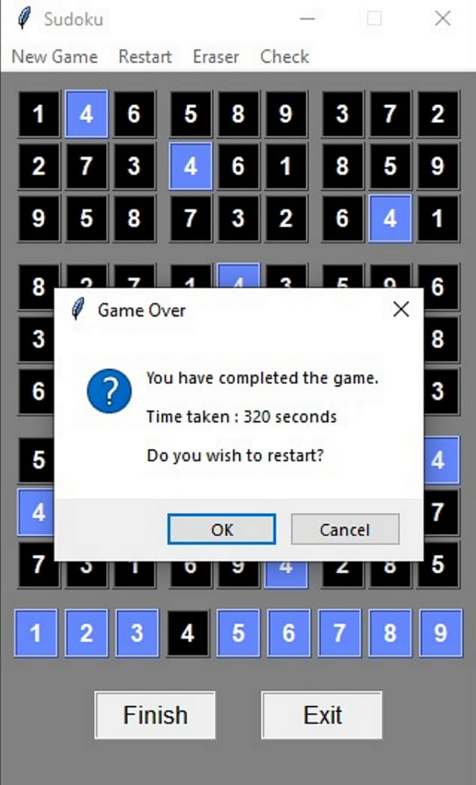

# Sudoku
A classy sudoku game made using python tkinter.

Sudoku is a game of numbers. You need to fill every row, column and box with numbers between 1-9.

### Initially
The sudoku made by me looks like this:

### Entering a number
When a number from the input box is selected the background of the selected number becomes black in input group and blue in the grid.

### Check
On pressing the check button from the menubar, all numbers on the wrong positions become red in color.

### End of Game
Once you have completed the sudoku, press finish. If you have done all correct then the game will end displaying the message of success.

